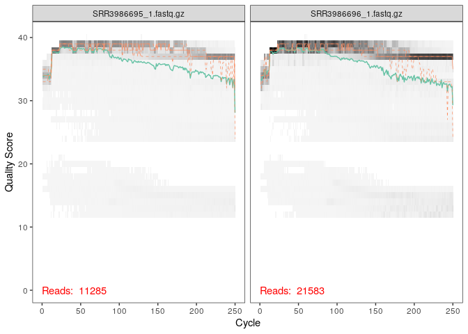
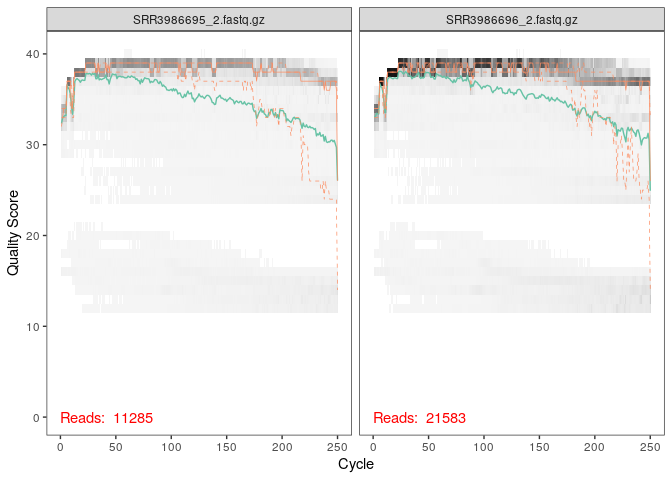

R Notebook
================

Les données ont été téléchargées, sur l’ordinateur, dans un même fichier
directement sur le site de l’ENA avec le numéro accession PRJNA335827.
Ce dossier a été ajouté à la VM via le New Folder et a été dézippé
automatiquement. Tous les reads ont été ajouté dans le dossier Run.

``` r
library(dada2)
```

    ## Loading required package: Rcpp

    ## Warning: multiple methods tables found for 'which'

``` r
path <- "~/Git/CC3/Run"
list.files(path)
```

    ##   [1] "SRR3986695_1.fastq.gz" "SRR3986695_2.fastq.gz" "SRR3986696_1.fastq.gz"
    ##   [4] "SRR3986696_2.fastq.gz" "SRR3986697_1.fastq.gz" "SRR3986697_2.fastq.gz"
    ##   [7] "SRR3986698_1.fastq.gz" "SRR3986698_2.fastq.gz" "SRR3986699_1.fastq.gz"
    ##  [10] "SRR3986699_2.fastq.gz" "SRR3986700_1.fastq.gz" "SRR3986700_2.fastq.gz"
    ##  [13] "SRR3986701_1.fastq.gz" "SRR3986701_2.fastq.gz" "SRR3986702_1.fastq.gz"
    ##  [16] "SRR3986702_2.fastq.gz" "SRR3986703_1.fastq.gz" "SRR3986703_2.fastq.gz"
    ##  [19] "SRR3986704_1.fastq.gz" "SRR3986704_2.fastq.gz" "SRR3986705_1.fastq.gz"
    ##  [22] "SRR3986705_2.fastq.gz" "SRR3986706_1.fastq.gz" "SRR3986706_2.fastq.gz"
    ##  [25] "SRR3986707_1.fastq.gz" "SRR3986707_2.fastq.gz" "SRR3986709_1.fastq.gz"
    ##  [28] "SRR3986709_2.fastq.gz" "SRR3986710_1.fastq.gz" "SRR3986710_2.fastq.gz"
    ##  [31] "SRR3986711_1.fastq.gz" "SRR3986711_2.fastq.gz" "SRR3986712_1.fastq.gz"
    ##  [34] "SRR3986712_2.fastq.gz" "SRR3986713_1.fastq.gz" "SRR3986713_2.fastq.gz"
    ##  [37] "SRR3986714_1.fastq.gz" "SRR3986714_2.fastq.gz" "SRR3986715_1.fastq.gz"
    ##  [40] "SRR3986715_2.fastq.gz" "SRR3986716_1.fastq.gz" "SRR3986716_2.fastq.gz"
    ##  [43] "SRR3986717_1.fastq.gz" "SRR3986717_2.fastq.gz" "SRR3986718_1.fastq.gz"
    ##  [46] "SRR3986718_2.fastq.gz" "SRR3986719_1.fastq.gz" "SRR3986719_2.fastq.gz"
    ##  [49] "SRR3986720_1.fastq.gz" "SRR3986720_2.fastq.gz" "SRR3986721_1.fastq.gz"
    ##  [52] "SRR3986721_2.fastq.gz" "SRR3986722_1.fastq.gz" "SRR3986722_2.fastq.gz"
    ##  [55] "SRR3986723_1.fastq.gz" "SRR3986723_2.fastq.gz" "SRR3986724_1.fastq.gz"
    ##  [58] "SRR3986724_2.fastq.gz" "SRR3986725_1.fastq.gz" "SRR3986725_2.fastq.gz"
    ##  [61] "SRR3986726_1.fastq.gz" "SRR3986726_2.fastq.gz" "SRR3986727_1.fastq.gz"
    ##  [64] "SRR3986727_2.fastq.gz" "SRR3986728_1.fastq.gz" "SRR3986728_2.fastq.gz"
    ##  [67] "SRR3986729_1.fastq.gz" "SRR3986729_2.fastq.gz" "SRR3986730_1.fastq.gz"
    ##  [70] "SRR3986730_2.fastq.gz" "SRR3986731_1.fastq.gz" "SRR3986731_2.fastq.gz"
    ##  [73] "SRR3986732_1.fastq.gz" "SRR3986732_2.fastq.gz" "SRR3986733_1.fastq.gz"
    ##  [76] "SRR3986733_2.fastq.gz" "SRR3986734_1.fastq.gz" "SRR3986734_2.fastq.gz"
    ##  [79] "SRR3986735_1.fastq.gz" "SRR3986735_2.fastq.gz" "SRR3986737_1.fastq.gz"
    ##  [82] "SRR3986737_2.fastq.gz" "SRR3986738_1.fastq.gz" "SRR3986738_2.fastq.gz"
    ##  [85] "SRR3986739_1.fastq.gz" "SRR3986739_2.fastq.gz" "SRR3986740_1.fastq.gz"
    ##  [88] "SRR3986740_2.fastq.gz" "SRR3986741_1.fastq.gz" "SRR3986741_2.fastq.gz"
    ##  [91] "SRR3986742_1.fastq.gz" "SRR3986742_2.fastq.gz" "SRR3986743_1.fastq.gz"
    ##  [94] "SRR3986743_2.fastq.gz" "SRR3986744_1.fastq.gz" "SRR3986744_2.fastq.gz"
    ##  [97] "SRR3986745_1.fastq.gz" "SRR3986745_2.fastq.gz" "SRR3986746_1.fastq.gz"
    ## [100] "SRR3986746_2.fastq.gz" "SRR3986747_1.fastq.gz" "SRR3986747_2.fastq.gz"
    ## [103] "SRR3986748_1.fastq.gz" "SRR3986748_2.fastq.gz" "SRR3986749_1.fastq.gz"
    ## [106] "SRR3986749_2.fastq.gz" "SRR3986750_1.fastq.gz" "SRR3986750_2.fastq.gz"
    ## [109] "SRR3986751_1.fastq.gz" "SRR3986751_2.fastq.gz" "SRR3986752_1.fastq.gz"
    ## [112] "SRR3986752_2.fastq.gz" "SRR3986753_1.fastq.gz" "SRR3986753_2.fastq.gz"
    ## [115] "SRR3986754_1.fastq.gz" "SRR3986754_2.fastq.gz" "SRR3986755_1.fastq.gz"
    ## [118] "SRR3986755_2.fastq.gz" "SRR3986756_1.fastq.gz" "SRR3986756_2.fastq.gz"
    ## [121] "SRR3986757_1.fastq.gz" "SRR3986757_2.fastq.gz" "SRR3986758_1.fastq.gz"
    ## [124] "SRR3986758_2.fastq.gz" "SRR3986759_1.fastq.gz" "SRR3986759_2.fastq.gz"
    ## [127] "SRR3986760_1.fastq.gz" "SRR3986760_2.fastq.gz" "SRR3986761_1.fastq.gz"
    ## [130] "SRR3986761_2.fastq.gz" "SRR3986762_1.fastq.gz" "SRR3986762_2.fastq.gz"
    ## [133] "SRR3986763_1.fastq.gz" "SRR3986763_2.fastq.gz" "SRR3986764_1.fastq.gz"
    ## [136] "SRR3986764_2.fastq.gz" "SRR3986765_1.fastq.gz" "SRR3986765_2.fastq.gz"
    ## [139] "SRR3986766_1.fastq.gz" "SRR3986766_2.fastq.gz" "SRR3986767_1.fastq.gz"
    ## [142] "SRR3986767_2.fastq.gz" "SRR3986768_1.fastq.gz" "SRR3986768_2.fastq.gz"
    ## [145] "SRR3986769_1.fastq.gz" "SRR3986769_2.fastq.gz" "SRR3986770_1.fastq.gz"
    ## [148] "SRR3986770_2.fastq.gz" "SRR3986771_1.fastq.gz" "SRR3986771_2.fastq.gz"
    ## [151] "SRR3986772_1.fastq.gz" "SRR3986772_2.fastq.gz" "SRR3986773_1.fastq.gz"
    ## [154] "SRR3986773_2.fastq.gz" "SRR3986774_1.fastq.gz" "SRR3986774_2.fastq.gz"
    ## [157] "SRR3986775_1.fastq.gz" "SRR3986775_2.fastq.gz" "SRR3986776_1.fastq.gz"
    ## [160] "SRR3986776_2.fastq.gz" "SRR3986777_1.fastq.gz" "SRR3986777_2.fastq.gz"
    ## [163] "SRR3986778_1.fastq.gz" "SRR3986778_2.fastq.gz" "SRR3986779_1.fastq.gz"
    ## [166] "SRR3986779_2.fastq.gz" "SRR3986780_1.fastq.gz" "SRR3986780_2.fastq.gz"
    ## [169] "SRR3986781_1.fastq.gz" "SRR3986781_2.fastq.gz" "SRR3986782_1.fastq.gz"
    ## [172] "SRR3986782_2.fastq.gz" "SRR3986783_1.fastq.gz" "SRR3986783_2.fastq.gz"
    ## [175] "SRR3986784_1.fastq.gz" "SRR3986784_2.fastq.gz" "SRR3986785_1.fastq.gz"
    ## [178] "SRR3986785_2.fastq.gz" "SRR3986786_1.fastq.gz" "SRR3986786_2.fastq.gz"
    ## [181] "SRR3986787_1.fastq.gz" "SRR3986787_2.fastq.gz" "SRR3986788_1.fastq.gz"
    ## [184] "SRR3986788_2.fastq.gz" "SRR3986789_1.fastq.gz" "SRR3986789_2.fastq.gz"
    ## [187] "SRR3986790_1.fastq.gz" "SRR3986790_2.fastq.gz" "SRR3986791_1.fastq.gz"
    ## [190] "SRR3986791_2.fastq.gz" "SRR3986792_1.fastq.gz" "SRR3986792_2.fastq.gz"
    ## [193] "SRR3986793_1.fastq.gz" "SRR3986793_2.fastq.gz" "SRR3986795_1.fastq.gz"
    ## [196] "SRR3986795_2.fastq.gz" "SRR3986796_1.fastq.gz" "SRR3986796_2.fastq.gz"
    ## [199] "SRR3986797_1.fastq.gz" "SRR3986797_2.fastq.gz" "SRR3986798_1.fastq.gz"
    ## [202] "SRR3986798_2.fastq.gz" "SRR3986799_1.fastq.gz" "SRR3986799_2.fastq.gz"
    ## [205] "SRR3986800_1.fastq.gz" "SRR3986800_2.fastq.gz" "SRR3986801_1.fastq.gz"
    ## [208] "SRR3986801_2.fastq.gz" "SRR3986802_1.fastq.gz" "SRR3986802_2.fastq.gz"
    ## [211] "SRR3986803_1.fastq.gz" "SRR3986803_2.fastq.gz" "SRR3986804_1.fastq.gz"
    ## [214] "SRR3986804_2.fastq.gz" "SRR3986805_1.fastq.gz" "SRR3986805_2.fastq.gz"
    ## [217] "SRR3986806_1.fastq.gz" "SRR3986806_2.fastq.gz" "SRR3986807_1.fastq.gz"
    ## [220] "SRR3986807_2.fastq.gz" "SRR3986808_1.fastq.gz" "SRR3986808_2.fastq.gz"

``` r
fnFs <- sort(list.files(path, pattern="1.fastq", full.names = TRUE))
fnRs <- sort(list.files(path, pattern="2.fastq", full.names = TRUE))
sample.namesFs <- sapply(strsplit(basename(fnFs), "\\."), `[`, 1)
sample.namesRs <- sapply(strsplit(basename(fnRs), "\\."), `[`, 1)
sample.namesFs
```

    ##   [1] "SRR3986695_1" "SRR3986696_1" "SRR3986697_1" "SRR3986698_1" "SRR3986699_1"
    ##   [6] "SRR3986700_1" "SRR3986701_1" "SRR3986702_1" "SRR3986703_1" "SRR3986704_1"
    ##  [11] "SRR3986705_1" "SRR3986706_1" "SRR3986707_1" "SRR3986709_1" "SRR3986710_1"
    ##  [16] "SRR3986711_1" "SRR3986712_1" "SRR3986713_1" "SRR3986714_1" "SRR3986715_1"
    ##  [21] "SRR3986716_1" "SRR3986717_1" "SRR3986718_1" "SRR3986719_1" "SRR3986720_1"
    ##  [26] "SRR3986721_1" "SRR3986722_1" "SRR3986723_1" "SRR3986724_1" "SRR3986725_1"
    ##  [31] "SRR3986726_1" "SRR3986727_1" "SRR3986728_1" "SRR3986729_1" "SRR3986730_1"
    ##  [36] "SRR3986731_1" "SRR3986732_1" "SRR3986733_1" "SRR3986734_1" "SRR3986735_1"
    ##  [41] "SRR3986737_1" "SRR3986738_1" "SRR3986739_1" "SRR3986740_1" "SRR3986741_1"
    ##  [46] "SRR3986742_1" "SRR3986743_1" "SRR3986744_1" "SRR3986745_1" "SRR3986746_1"
    ##  [51] "SRR3986747_1" "SRR3986748_1" "SRR3986749_1" "SRR3986750_1" "SRR3986751_1"
    ##  [56] "SRR3986752_1" "SRR3986753_1" "SRR3986754_1" "SRR3986755_1" "SRR3986756_1"
    ##  [61] "SRR3986757_1" "SRR3986758_1" "SRR3986759_1" "SRR3986760_1" "SRR3986761_1"
    ##  [66] "SRR3986762_1" "SRR3986763_1" "SRR3986764_1" "SRR3986765_1" "SRR3986766_1"
    ##  [71] "SRR3986767_1" "SRR3986768_1" "SRR3986769_1" "SRR3986770_1" "SRR3986771_1"
    ##  [76] "SRR3986772_1" "SRR3986773_1" "SRR3986774_1" "SRR3986775_1" "SRR3986776_1"
    ##  [81] "SRR3986777_1" "SRR3986778_1" "SRR3986779_1" "SRR3986780_1" "SRR3986781_1"
    ##  [86] "SRR3986782_1" "SRR3986783_1" "SRR3986784_1" "SRR3986785_1" "SRR3986786_1"
    ##  [91] "SRR3986787_1" "SRR3986788_1" "SRR3986789_1" "SRR3986790_1" "SRR3986791_1"
    ##  [96] "SRR3986792_1" "SRR3986793_1" "SRR3986795_1" "SRR3986796_1" "SRR3986797_1"
    ## [101] "SRR3986798_1" "SRR3986799_1" "SRR3986800_1" "SRR3986801_1" "SRR3986802_1"
    ## [106] "SRR3986803_1" "SRR3986804_1" "SRR3986805_1" "SRR3986806_1" "SRR3986807_1"
    ## [111] "SRR3986808_1"

``` r
sample.namesRs
```

    ##   [1] "SRR3986695_2" "SRR3986696_2" "SRR3986697_2" "SRR3986698_2" "SRR3986699_2"
    ##   [6] "SRR3986700_2" "SRR3986701_2" "SRR3986702_2" "SRR3986703_2" "SRR3986704_2"
    ##  [11] "SRR3986705_2" "SRR3986706_2" "SRR3986707_2" "SRR3986709_2" "SRR3986710_2"
    ##  [16] "SRR3986711_2" "SRR3986712_2" "SRR3986713_2" "SRR3986714_2" "SRR3986715_2"
    ##  [21] "SRR3986716_2" "SRR3986717_2" "SRR3986718_2" "SRR3986719_2" "SRR3986720_2"
    ##  [26] "SRR3986721_2" "SRR3986722_2" "SRR3986723_2" "SRR3986724_2" "SRR3986725_2"
    ##  [31] "SRR3986726_2" "SRR3986727_2" "SRR3986728_2" "SRR3986729_2" "SRR3986730_2"
    ##  [36] "SRR3986731_2" "SRR3986732_2" "SRR3986733_2" "SRR3986734_2" "SRR3986735_2"
    ##  [41] "SRR3986737_2" "SRR3986738_2" "SRR3986739_2" "SRR3986740_2" "SRR3986741_2"
    ##  [46] "SRR3986742_2" "SRR3986743_2" "SRR3986744_2" "SRR3986745_2" "SRR3986746_2"
    ##  [51] "SRR3986747_2" "SRR3986748_2" "SRR3986749_2" "SRR3986750_2" "SRR3986751_2"
    ##  [56] "SRR3986752_2" "SRR3986753_2" "SRR3986754_2" "SRR3986755_2" "SRR3986756_2"
    ##  [61] "SRR3986757_2" "SRR3986758_2" "SRR3986759_2" "SRR3986760_2" "SRR3986761_2"
    ##  [66] "SRR3986762_2" "SRR3986763_2" "SRR3986764_2" "SRR3986765_2" "SRR3986766_2"
    ##  [71] "SRR3986767_2" "SRR3986768_2" "SRR3986769_2" "SRR3986770_2" "SRR3986771_2"
    ##  [76] "SRR3986772_2" "SRR3986773_2" "SRR3986774_2" "SRR3986775_2" "SRR3986776_2"
    ##  [81] "SRR3986777_2" "SRR3986778_2" "SRR3986779_2" "SRR3986780_2" "SRR3986781_2"
    ##  [86] "SRR3986782_2" "SRR3986783_2" "SRR3986784_2" "SRR3986785_2" "SRR3986786_2"
    ##  [91] "SRR3986787_2" "SRR3986788_2" "SRR3986789_2" "SRR3986790_2" "SRR3986791_2"
    ##  [96] "SRR3986792_2" "SRR3986793_2" "SRR3986795_2" "SRR3986796_2" "SRR3986797_2"
    ## [101] "SRR3986798_2" "SRR3986799_2" "SRR3986800_2" "SRR3986801_2" "SRR3986802_2"
    ## [106] "SRR3986803_2" "SRR3986804_2" "SRR3986805_2" "SRR3986806_2" "SRR3986807_2"
    ## [111] "SRR3986808_2"

``` r
plotQualityProfile(fnFs[1:2])
```

<!-- -->

``` r
plotQualityProfile(fnRs[1:2])
```

<!-- -->
